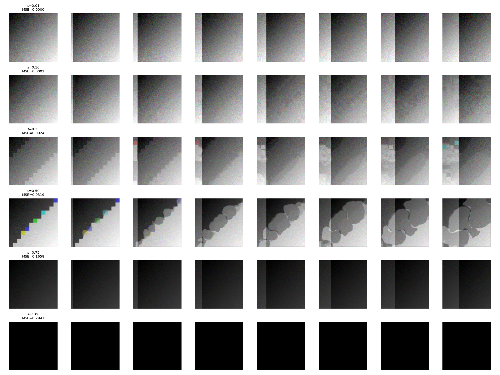
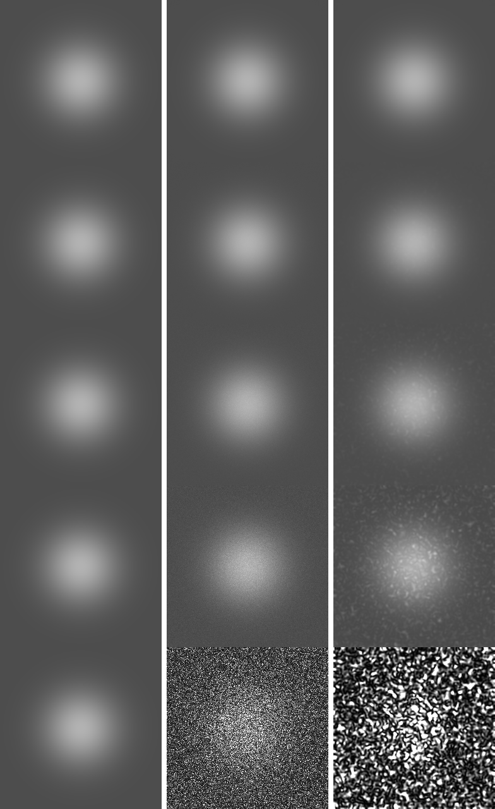

# Distortion Library


A production-grade PyTorch library for differentiable image degradation
and physics-based augmentation for computer vision.

## What This Is

Physics-based distortion modules for CV robustness testing and synthetic
dataset generation. Every module is:

- **Physics-based** — turbulence follows Kolmogorov, FRC blur uses
  optical-flow temporal integration, JPEG re-compression follows DCT
  quantization with multi-generation accumulation, speckle follows
  multiplicative coherent-imaging statistics.
- **Differentiable** — end-to-end, `gradcheck`-clean.
- **Reproducible** — deterministic per-sample seeding (BLAKE2b-64).
- **Batch-invariant** — per-path RNG keyed by `(seed, batch_index)`;
  same batch + seed reproduces bit-identically.
- **Tested** — pytest suite per module.

## Available Distortions

| ID   | Name                                     | Category    | Input          |
|------|------------------------------------------|-------------|----------------|
| 1004 | Atmospheric Turbulence Blur              | Optical     | Image          |
| —    | FRC Optical Flow Blur                    | Temporal    | Image + Video  |
| 1006 | Multi-Generation Re-Compression          | Compression | Image (RGB)    |
| 1007 | Multi-Generation Video Transcode Cascade | Temporal    | Video (RGB)    |
| 1008 | Speckle Noise (Coherent Imaging)         | Noise       | Image (linear) |

**Legend:**
- *Image* = `(C,H,W)` and `(B,C,H,W)`
- *Video* = also `(B,T,C,H,W)`
- *linear* = scene-referred linear intensity (linearize sRGB before use)

## Quick Start

### Static image — atmospheric turbulence

```python
import torch
from distortion_library import blur_atmospheric_turbulence_v1

x = torch.rand(1, 3, 256, 256)          # (B, C, H, W)
distorted, label = blur_atmospheric_turbulence_v1(x, severity=0.5, seed=42)
# label = [1004.0, 0.5]
```

### Video — FRC optical flow blur

```python
from distortion_library import blur_frc_optical_flow_v1

video = torch.rand(2, 8, 3, 128, 128)   # (B, T, C, H, W)
distorted, label = blur_frc_optical_flow_v1(video, severity=0.5, seed=42)
```

### RGB image — JPEG re-compression

```python
from distortion_library import compression_recompression_v1

x = torch.rand(2, 3, 256, 256)          # (B, C, H, W)
distorted, label = compression_recompression_v1(x, severity=0.5)
```

### Video — multi-generation transcode cascade

```python
from distortion_library import mgtc_cascade_v1

video = torch.rand(2, 8, 3, 128, 128)   # (B, T, C, H, W)
distorted, label = mgtc_cascade_v1(video, severity=0.5)
# label = [1007.0, 0.5]
```

### Linear-intensity image — speckle noise (SAR / laser / ultrasound)

```python
from distortion_library import speckle_coherent_v1

x = torch.rand(2, 3, 256, 256)          # (B, C, H, W), linear intensity
distorted, label = speckle_coherent_v1(x, severity=0.5, seed=42)
# label = [1008.0, 0.5]

# Spatially-correlated speckle (PSF-modelled) for realistic SAR imagery:
distorted, _ = speckle_coherent_v1(x, severity=0.5, rho=2.0, seed=42)
```

**Note:** this module expects *linear intensity* input (scene-referred).
Linearize sRGB before use and re-encode after.

## Visual Output

### Atmospheric Turbulence Blur — Severity Sweep


Input image followed by seven increasing severities (0.05 → 1.00).
Heat shimmer and tilt displacement become visible from s ≈ 0.30 onward.

### FRC Optical Flow Blur — Severity Sweep


Input image followed by seven increasing severities (0.05 → 1.00), all
rendered from the same seed so the differences are attributable purely
to severity.

### Multi-Generation Re-Compression — Severity Sweep


Three test patterns (checkerboard, gradient, smooth) at seven severities.
The checkerboard exposes 8×8 block artifacts; the gradient reveals
banding; MSE vs. severity curve:


### Multi-Generation Video Transcode Cascade — Severity Sweep



Eight-frame clip at six severities (0.01 → 1.00). Temporal drift and
deblocking artifacts accumulate across I/P frames; MSE grows monotonically
with severity.

### Speckle Noise — Severity Sweep



Five severities (0.01 → 1.00). Columns: [clean | i.i.d. lognormal |
spatially correlated ρ = 2.0]. The correlated column preserves the
multiplicative mean while introducing PSF-scale graininess.

## Installation

```bash
pip install -r requirements.txt
```

## Testing

```bash
pytest tests/ -v -m "not benchmark and not slow"
```

## Architecture

Every distortion follows the same wrapper contract:

```python
def xxx_wrapper(
    image: torch.Tensor,
    severity,
    seed=None,
    generator=None,
    value_range=(0.0, 1.0),
    **kwargs,
) -> tuple[torch.Tensor, torch.Tensor]:
    """Returns (distorted_image, label)."""
```

See [`DEVELOPMENT.md`](DEVELOPMENT.md) for the full development workflow.

## License

MIT — see [LICENSE](LICENSE).
```
